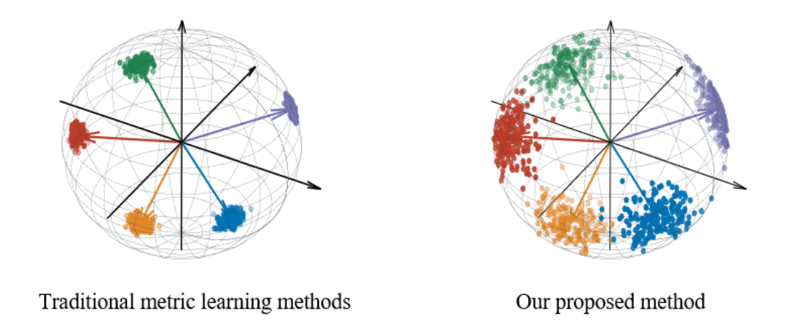
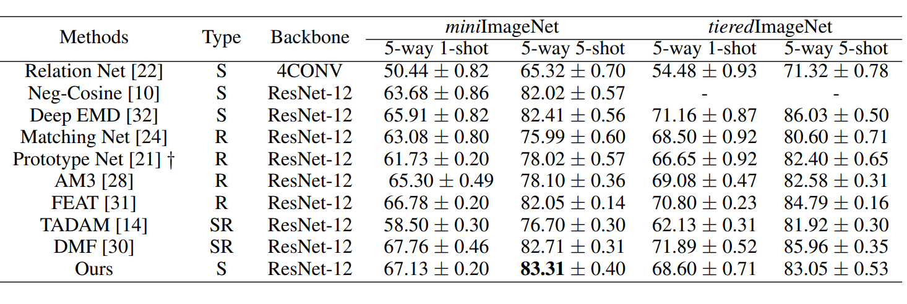

# vMF-Loss-Exploring-a-Scatter-Intra-class-Hypersphere-for-Few-shot-Learning
The code repository for "vMF-Loss-Exploring-a-Scatter-Intra-class-Hypersphere-for-Few-shot-Learning"
## OUR WORK
we perform investigations to study the relationship between the performance and the structure of their learned embedding spaces. 
We find that the few-shot performance strongly correlated to the intra-class distance of the learned embedding space. 
We assume a scatter intra-class distribution on base classes can capture more valuable features for novel classes. 
Therefore, we employ von Mises-Fisher (vMF) distribution and present a vMF similarity loss function that uses a concentration parameter κ to control the intra-class distribution on a hypersphere. 
By setting a smaller κ  our method can learn a more transferrable embedding space with high intra class diversity. 
Extensive experiments on the two most widely used datasets demonstrate the effectiveness of our method on few-shot learning tasks. 

## Resources
- gpu  `TU102 [GeForce RTX 2080 Ti]`

- cpu  `Intel(R) Xeon(R) Silver 4210 CPU @ 2.20GHz`

## Prerequisites

The following packages are required to run the scripts:

- [PyTorch-1.4 and torchvision](https://pytorch.org)

- Package [tensorboardX](https://github.com/lanpa/tensorboardX)

- Dataset: please download the dataset and put images into the folder data/[name of the dataset]/images

## Model Training and Evaluation

### miniimagenet 1shot
`python train_fsl.py --dataset MiniImageNet --init_weights ./saves/initialization/miniimagenet/Res12-pre.pth`

### miniimagenet 5shot
`python train_fsl.py --shot 5 --eval_shot 5 --dataset MiniImageNet --init_weights ./saves/initialization/miniimagenet/Res12-pre.pth`

### miniimagenet 1shot
`python train_fsl.py --dataset TieredImageNet --init_weights ./saves/initialization/tieredimagenet/Res12-pre.pth`

### miniimagenet 5shot
`python train_fsl.py --shot 5 --eval_shot 5 --dataset TieredImageNet --init_weights ./saves/initialization/tieredimagenet/Res12-pre.pth`

## Standard Few-shot Learning Results

## Acknowledgment
We thank the following repos providing helpful components/functions in our work.
- [FEAT](https://github.com/Sha-Lab/FEAT)
